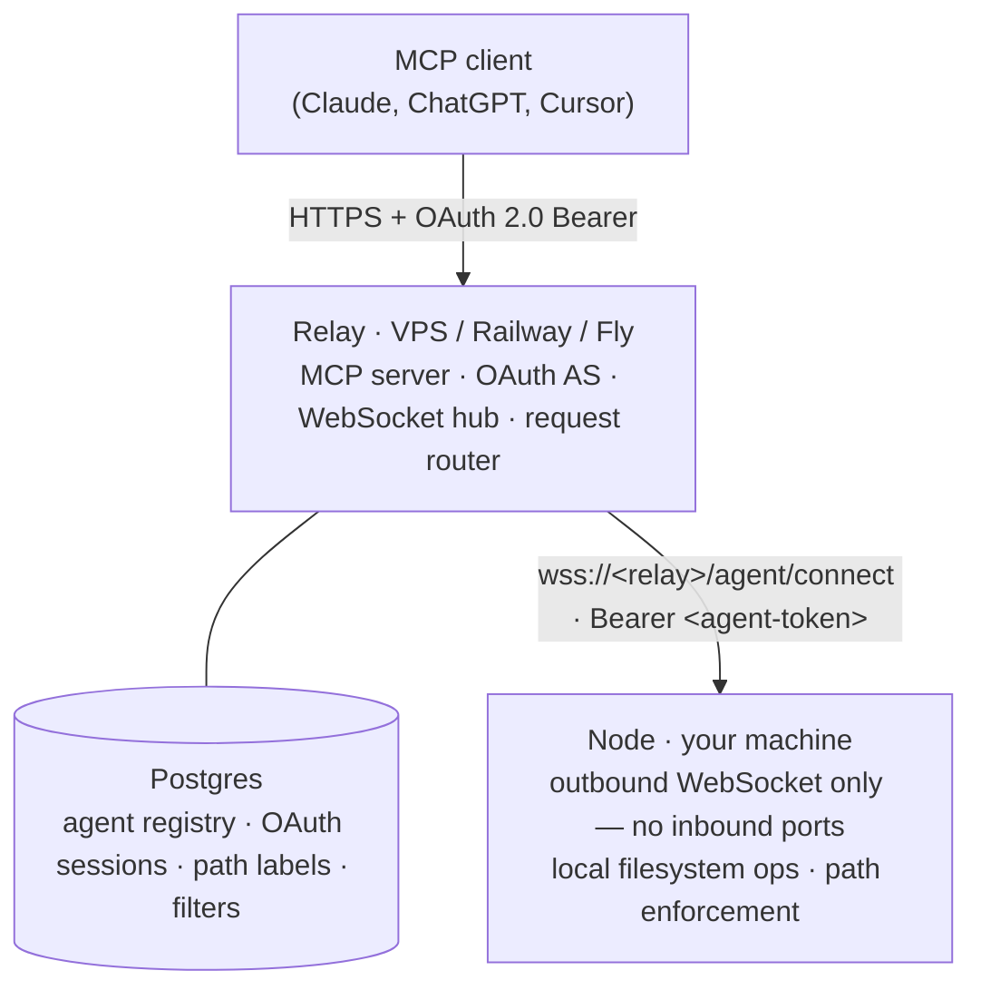

# Architecture

- [Design Philosophy](#design-philosophy)
- [Components](#components)
- [Relay](#relay)
- [Node](#node)
- [MCP Connection](#mcp-connection)
- [Security](#security)

---

## Design Philosophy

**The node is the security boundary.** The relay routes requests but cannot grant the node access to any path it has not explicitly permitted in its local config. A compromised relay can restrict or replay requests, but it cannot expand the node's filesystem access.

**No inbound ports on the node.** The node connects outbound to the relay over WebSocket and holds that connection open. There is nothing to expose, nothing to firewall, and no IP to keep stable. The relay is the only component that needs a public address.

**CLI-first.** Every action — node setup, path management, token rotation, relay administration — is accessible from the command line. The GUI and any future web UI are convenience layers on top of a complete CLI; nothing requires them.

**All config is local to the node.** The node reads `node.yaml` and `paths.yaml` from disk at startup. The relay stores a copy of path labels for routing and display, but that copy is always derived from what the node pushes — it is never authoritative. If the relay's copy diverges from the node's local config, the node's config wins at enforcement time.

**Reconnection is stateless.** Because all persistent config lives in either the local filesystem (node) or Postgres (relay), a node reconnect requires nothing beyond token validation. No handshake, no re-registration, no re-delivery of state.

---

## Components



| Component | Runs where | Responsibility |
|---|---|---|
| Relay | VPS, Railway, or Fly | MCP server, OAuth authorization server, WebSocket hub, request routing, liveness tracking |
| Node | Any machine | WebSocket client, filesystem operations, path enforcement |
| Postgres | Sidecar to relay | Agent registry, OAuth sessions, path labels, path filters |

**Stack:** TypeScript throughout. Relay on Node.js; node distributed as a standalone `constellation` binary. Prisma for database access and migrations. Pino for structured logging.

---

## Relay

The relay has three layers that operate in sequence on every MCP tool call.

### OAuth layer

The relay acts as an OAuth 2.0 authorization server to MCP clients, and as an OIDC client to an upstream identity provider (Google, Azure AD, Authentik, or any OIDC-compliant provider).

MCP clients authenticate via the **Authorization Code flow** (with mandatory PKCE). Dynamic Client Registration (RFC 7591) is supported as the primary path — Claude, ChatGPT, and Cursor attempt DCR automatically on first connection.

The node CLI and relay CLI authenticate via the **Device Code flow** (RFC 8628). Scope determines which flow is served:
- `agent:register` — creates an agent registration and returns an agent token
- `relay:manage` — issues a management API session for `constellation relay` commands

Tokens are 32-byte cryptographically random values stored as SHA-256 hashes. They are never logged in plaintext.

### WebSocket hub

Agents connect to `/agent/connect` with their agent token in the `Authorization` header. The relay validates the token, then holds the connection in an in-memory map keyed by `executorId`. Only one WebSocket per agent is permitted — a new connection from the same agent terminates the previous one (assumed stale).

The relay pings each connected agent every `HEARTBEAT_INTERVAL_SECONDS` (default 60s). The agent's WebSocket library responds with a pong automatically. Each pong updates `last_heartbeat_at` in Postgres. After `HEARTBEAT_MAX_MISSED` (default 3) consecutive missed pongs, the relay terminates the connection.

On connect, the agent immediately sends a `config_update` message with its current path labels. The relay upserts those labels in Postgres — adding new ones, updating paths on existing ones, removing any not present in the payload. This keeps routing information current without requiring a restart.

### Request router

When an MCP client calls a tool, the relay:

1. Resolves the Bearer token to a `user_id`
2. Resolves the `label` (and optional `host`) to a target `executor_id` and `absolute_root` path
3. Applies relay-side deny filters (glob or regex patterns)
4. Looks up the live WebSocket for that agent
5. Forwards an RPC envelope: `{ request_id, tool, absolute_root, ...tool_params }`
6. Waits up to `RPC_TIMEOUT_MS` (default 30s) for a response
7. Returns the result or a structured error to the MCP client

The relay passes `absolute_root` — the resolved filesystem path — directly in the RPC envelope. The node never sees label names; it only validates paths. This means the relay cannot fabricate a root the node doesn't know about: it can only route to paths that exist in the node's local `paths.yaml`.

If the node disconnects while an RPC is in flight, the relay immediately rejects all pending requests for that agent. Operations are not retried; any mid-flight filesystem op is left in its current state.

### Data model

```
users            id, oidc_sub, email, deactivated_at
executor_tokens  id, user_id, token_hash, last_used_at, revoked_at
executors        id, user_id, executor_token_id, host, last_heartbeat_at
path_labels      id, user_id, executor_id, label, reported_path  [UNIQUE (user_id, label)]
relay_path_filters   id, user_id, scope_executor_id, pattern, pattern_type
oauth_clients    id, client_secret_hash, redirect_uris, is_dynamic
oauth_sessions   id, user_id, mcp_client_id, access_token_hash, expires_at, refresh_token_hash
```

`deactivated_at` on `users` is nullable — when set, all requests and executor connections for that user are rejected immediately; config and registrations are preserved but inert. `revoked_at` on `executor_tokens` is nullable; `IS NOT NULL` is the revocation check.

---

## Node

### Connection

On startup the node connects to `wss://<relay_url>/agent/connect` with `Authorization: Bearer <agent_token>`. It immediately sends a `config_update` with the current `paths.yaml`, then enters a receive loop waiting for RPC envelopes and control messages.

**Reconnect backoff:** starts at 1 second, doubles on each failure up to 60 seconds, with ±20% jitter. Reconnects indefinitely. Because all config is local, reconnection requires no handshake beyond token validation.

**TLS enforcement:** the node refuses to connect over `http://` (or `ws://`) to any host that is not `localhost`, `127.0.0.1`, or `::1`. The agent token is a long-lived credential; transmitting it unencrypted to a remote host is not permitted.

### Request handling

For every incoming RPC:

1. Validate `absolute_root` against the local `paths.yaml` allowlist — exact match required
2. Resolve the full path: `fs.realpath(absolute_root + relative_path)` (follows symlinks, canonicalises `..`)
3. Confirm the resolved path is prefixed by the resolved root — rejects traversal and symlink escapes
4. Execute the operation
5. Return `{ request_id, result }` or `{ request_id, error }`

For cross-label `copy` and `move`, the relay also supplies `dst_root`. The node validates `dst_root` against the allowlist and applies the same traversal check against it for `dst_relative_path`. For write targets that don't exist yet, the nearest existing parent is resolved and the suffix reconstructed — so new files can be created within the root without bypassing the check.

### Token rotation

Token rotation is node-initiated — the relay cannot push a new token unsolicited:

1. Node sends `{ type: "rotate_token" }` over the existing WebSocket
2. Relay generates a new token, stores it, returns `{ type: "token_rotated", token: "<new>" }`
3. Node writes the new token to `node.yaml` and reconnects
4. Relay revokes the old token atomically on successful reconnect with the new token

The node has a 5-minute window to reconnect. If it does not, the new token is revoked and the old token continues to work — no lockout occurs. If both tokens are independently revoked during the window, the node must re-run `constellation node init`.

### Config

```
~/.config/constellation/      (Linux/macOS)
%APPDATA%\constellation\      (Windows)
  node.yaml        — relay URL, node token, host name, max_file_size_kb
  paths.yaml       — path label definitions
  relay-session.yaml  — relay CLI OAuth session (written by constellation relay login)
```

Config files are read at startup. The node does not watch them for changes. `constellation node sync` sends a fresh `config_update` mid-session after a manual edit. `node paths add` and `node paths remove` modify `paths.yaml` and sync immediately.

---

## MCP Connection

The relay exposes a standard `/.well-known/oauth-authorization-server` discovery document. MCP clients that support OAuth discovery (Claude, ChatGPT, Cursor) find the authorization endpoint automatically when the relay URL is added to their config — no manual OAuth setup is required.

**First connection flow:**
1. Client discovers `/.well-known/oauth-authorization-server`
2. Client attempts Dynamic Client Registration (`POST /oauth/register`) — most clients do this automatically
3. Client redirects the user to `/oauth/authorize` (with PKCE)
4. Relay redirects to the upstream OIDC provider; user authenticates
5. Relay exchanges the OIDC code, upserts a user row, issues its own access + refresh tokens
6. Client exchanges the auth code for tokens at `POST /oauth/token`
7. Client calls `POST /mcp` with `Authorization: Bearer <access_token>`

Refresh tokens are rotated on use. If a refresh token expires, the client prompts re-authentication. Access tokens default to 24-hour lifetime; refresh tokens default to 30 days — both are configurable via relay environment variables.

**Adding the relay to an MCP client:**

| Client | Config |
|---|---|
| Claude (claude.ai) | Settings → Integrations → add `https://<relay>/mcp` |
| ChatGPT | Settings → Apps & Connectors → Add new connector (Pro/Team/Enterprise/Edu only) |
| Cursor | `.cursor/mcp.json`: `{ "mcpServers": { "constellation": { "url": "https://<relay>/mcp" } } }` |

---

## Security

### Trust model

| Layer | Can grant access | Can restrict access |
|---|---|---|
| Node local config (`paths.yaml`) | Yes — sole authority | Yes |
| Relay path filters | No | Yes — deny-only overlay |
| Node runtime check | — | Always enforced, independent of relay |

The relay resolves a label to an `absolute_root` and forwards it to the node. The node independently validates that root against its own `paths.yaml`. Because the node holds the allowlist locally, a compromised relay cannot forge a root the node doesn't recognise — it can at most send a path the node will reject.

Relay path filters are a further restrict-only layer applied before an RPC is dispatched. They cannot grant access to anything the node would otherwise allow.

### Path validation

Two checks run in sequence before every operation:

**1. Root allowlist check** — the `absolute_root` in the RPC envelope must match a path in `paths.yaml` exactly. Any other value is rejected with `"Path rejected by node"` — deliberately terse; no internal path info is forwarded to the MCP client. Full detail (`tool`, `absolute_root`) is logged for operator troubleshooting only.

**2. Traversal and symlink check** — every path field in the RPC (`relative_path`, `src_relative_path`, `dst_relative_path`) is resolved via `fs.realpath()`, which follows symlinks and canonicalises `..`. If the resolved path does not begin with the resolved root, the request is rejected. This prevents both `../` traversal and symlink escapes that point outside the label root.

### Token security

- Agent tokens and OAuth tokens are 32-byte cryptographically random values, encoded as 64-character hex strings
- Stored in Postgres as SHA-256 hashes; never logged in plaintext
- Agent tokens are long-lived credentials — `node.yaml` and `relay-session.yaml` should be `chmod 600`
- The node refuses to transmit its token over an unencrypted connection to a non-localhost host

### Rate limiting

| Surface | Default | Config variable |
|---|---|---|
| MCP tool calls | 60 req/min per user | `RATE_LIMIT_TOOL_CALLS_PER_MIN` |
| Expensive tools (`grep_files`, `find_files`, recursive `list_directory`) | 20 req/min per user | `RATE_LIMIT_EXPENSIVE_TOOLS_PER_MIN` |
| OAuth endpoints | 10 req/15 min per IP | `RATE_LIMIT_OAUTH_PER_15MIN` |
| Device code polling | 200 req/15 min per IP | `RATE_LIMIT_DEVICE_POLL_PER_15MIN` |
| Agent WebSocket reconnects | 10 req/min per agent token | `RATE_LIMIT_WS_RECONNECT_PER_MIN` |

Rate limit state is in-memory — no Redis required. State is lost on relay restart, which is acceptable.

### Account deactivation

Setting `deactivated_at` on a user record immediately blocks all MCP requests and agent connections for that user. Config, agent registrations, and path labels are preserved but inert. Re-activation requires a database-level change; there is no CLI command to re-activate.
