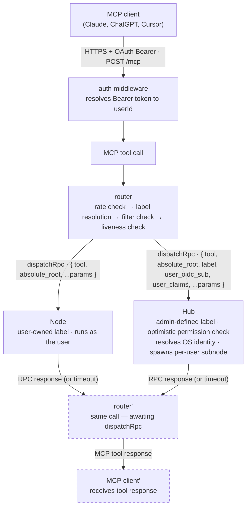
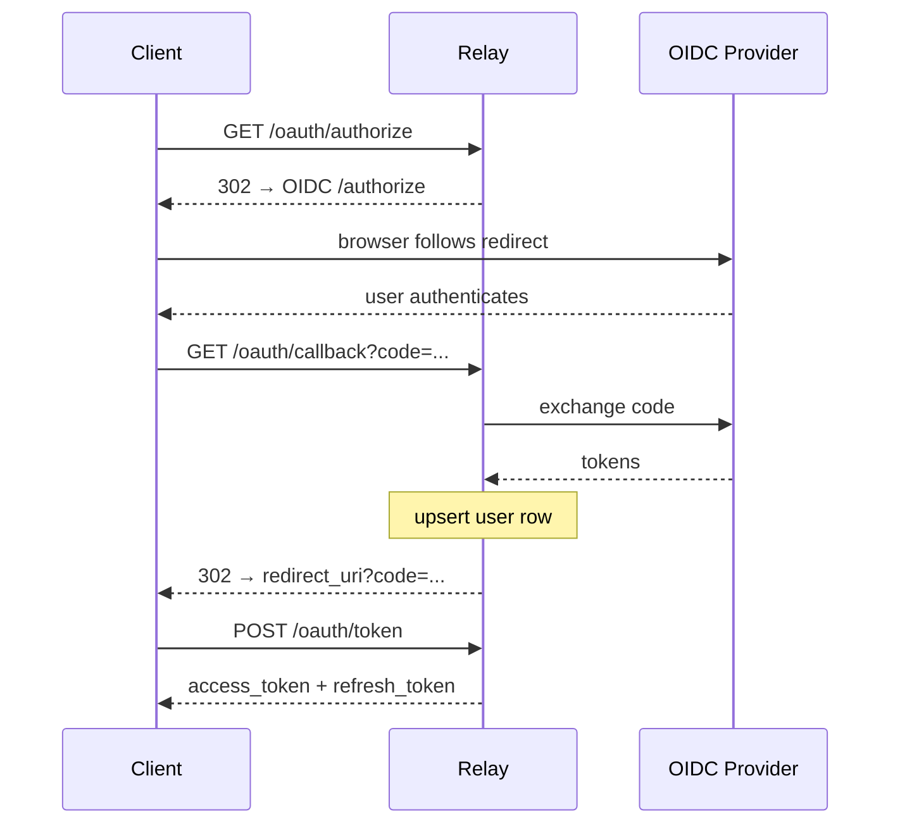
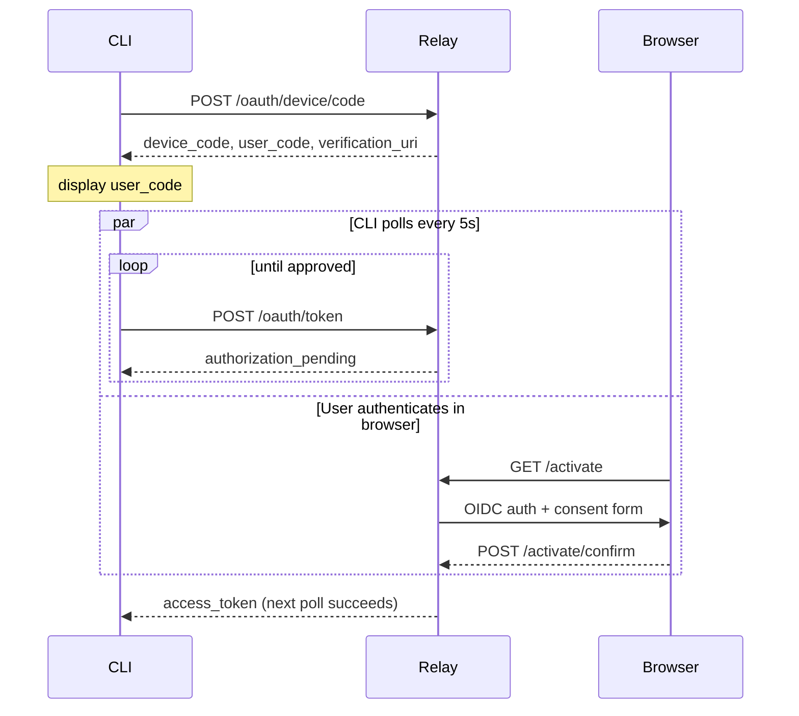

# Relay Reference

The relay is a stateful HTTP/WebSocket server that sits between MCP clients and agents. It owns authentication, routing, and path filtering. Agents connect out to the relay — the relay never initiates connections inward.

---

## Architecture



Agents connect over WebSocket to `wss://<relay>/agent/connect` using a long-lived bearer token. The relay keeps one connection per agent in memory (see [`registry.ts`](../packages/relay/src/registry.ts)) and heartbeats it with WebSocket pings.

Agents come in two modalities, distinguished by `AgentTokenType`:

- **Personal** (a node) — bound to one user; runs under the user's own OS identity. Labels are user-managed, synced via `config_update`, and stored as `PathLabel` rows.
- **Shared** (a hub) — service-level, not bound to any user; runs on machines shared by multiple people (NAS, dev server). Labels are admin-defined in the hub's config, synced via `shared_label_sync`, and stored as `SharedPathLabel` rows alongside a per-label `permission_blob`. The relay performs an *optimistic* permission check against that blob during label resolution — final enforcement (OS identity resolution, label access, sub-path permissions) happens authoritatively at the hub. See [Hub](hub.md) for the full request flow, identity resolution chain, and permission model.

Because the relay cannot resolve a hub's per-request OS identity itself, requests routed to a hub carry the requesting user's `label`, `user_oidc_sub`, and `user_claims` in the RPC envelope — see [RPC Protocol](#rpc-protocol).

---

## MCP Apps

The relay implements the [MCP Apps extension](https://github.com/modelcontextprotocol/ext-apps) (`io.modelcontextprotocol/ui`), which lets a tool call render rich, interactive UI inline in a supporting client (Claude.ai, Claude Desktop, VS Code Insiders, Goose, Postman) instead of plain text.

### `open_file_browser`

A trigger tool that launches an interactive file browser — directory tree, syntax-highlighted viewer, and editor — rendered inline in the conversation.

| Param | Type | Description |
|---|---|---|
| `label` | string? | Label to open the browser on |
| `path` | string? | Initial path within the label |

It declares `_meta.ui.resourceUri: "ui://constellation/file-browser"`. On a supporting client, the host fetches that resource (a single bundled HTML page built from `packages/telescope` and served via `resources/read`), renders it in a sandboxed iframe, and forwards the tool's input and result to it via `ui/notifications/tool-input` / `ui/notifications/tool-result`. From there the iframe drives the session itself — calling `list_labels`, `list_directory`, `read_file`, and `write_file` directly through `app.callServerTool()`, proxied by the host back through the same authenticated MCP connection. There is no separate HTTP route, credential flow, or session for the UI; it rides entirely on the existing MCP session and the relay's normal dispatch path (see [Architecture](#architecture)).

On clients that don't support `io.modelcontextprotocol/ui`, `open_file_browser` degrades gracefully to a plain text-only tool — it returns a label or directory listing summary instead of launching the UI. The other file tools are unaffected either way.

### Tool visibility

Tools declare `_meta.ui.visibility` to control where they can be called from:

- `["model"]` — callable by the agent (model) only; hidden from the rendered app
- `["model", "app"]` — callable by both the agent and the app's iframe

This maps onto how humans and agents tend to work with files differently: a human editing through the file browser saves the whole buffer at once, while an agent makes targeted, conversational edits. Accordingly `write_file` (full overwrite) is `["model", "app"]` so the app can use it to save, while `edit_file` (exact-match substitution), along with `copy`, `move`, `delete`, `create_directory`, and `list_hosts`, are `["model"]` — agent-only operations the app has no use for. `open_file_browser` and the read/navigation tools (`list_labels`, `list_directory`, `read_file`, `find_files`, `grep_files`, `file_info`) are `["model", "app"]`, since both the agent and the app need to browse and read.

---

## Management API

All `/api/*` endpoints (except `/api/status`) require a valid Bearer token obtained via `constellation relay login` (OAuth device code flow). The token is an OAuth access token tied to a user session — there is no separate API key or scope requirement.

**Admin-gated endpoints** additionally require an active admin elevation window, obtained via `constellation relay elevate`. Without elevation those endpoints return `403 ESCALATION_REQUIRED`.

**Error responses** follow:
```json
{ "error": "<code>", "error_description": "<human-readable>" }
```

Common auth errors:

| Status | `error` | Meaning |
|---|---|---|
| `401` | `unauthorized` | Bearer token missing |
| `401` | `invalid_token` | Token expired or not found |
| `403` | `ESCALATION_REQUIRED` | Admin endpoint — run `constellation relay elevate` |

### Pagination

All list endpoints support `limit` (1–1000, default 100) and `offset` (default 0) query params. Paginated responses have this envelope:

```json
{ "data": [...], "total": 42, "limit": 100, "offset": 0 }
```

---

### `GET /api/status`

Relay health check. No auth required.

**Response `200`**
```json
{
  "status": "ok",
  "uptime_seconds": 3724,
  "version": "0.3.1"
}
```

---

### `GET /api/me`

Return current session info.

**Response `200`**
```json
{ "session_id": "<id>", "user_id": "<id>" }
```

---

### `GET /api/agents`

List all agents registered to the authenticated user. Paginated.

**Response `200`** — paginated array of agent objects:

| Field | Type | Description |
|---|---|---|
| `id` | string | Agent ID (cuid) |
| `host` | string | Host name assigned at registration |
| `registered_at` | ISO 8601 | When the agent was first registered |
| `last_heartbeat_at` | ISO 8601 \| null | Last successful heartbeat pong |
| `last_disconnect_reason` | string \| null | Reason for last WebSocket close, if any |
| `online` | boolean | Whether the last heartbeat is within the threshold |
| `connected` | boolean | Whether a live WebSocket is open right now |
| `token_id` | string | Current agent token ID |
| `token_last_used_at` | ISO 8601 \| null | Last time the token authenticated a connection |
| `labels` | `{ label, reported_path }[]` | Path labels reported by the agent |

---

### `DELETE /api/agents/:id/token`

Revoke an agent's token. Any active WebSocket for that agent is terminated immediately. The agent will fail to reconnect until re-initialized.

**Path params**: `id` — agent ID from `GET /api/agents`.

**Responses**

| Status | Meaning |
|---|---|
| `204` | Token revoked |
| `404` | Agent not found or belongs to another user |
| `409` | Token already revoked |

---

### `GET /api/labels`

List path labels for the authenticated user. Paginated.

**Query params**

| Param | Description |
|---|---|
| `agent_id` | Filter to a specific agent (optional) |
| `limit` | Max results (default 100, max 1000) |
| `offset` | Pagination offset (default 0) |

**Response `200`** — paginated array:

| Field | Type |
|---|---|
| `id` | string |
| `label` | string |
| `reported_path` | string — absolute path on the agent machine |
| `agent_id` | string |
| `host` | string |

---

### `GET /api/filters`

List active relay path filters for the authenticated user. Paginated.

**Response `200`** — paginated array:

| Field | Type | Description |
|---|---|---|
| `id` | string | Filter ID |
| `pattern` | string | Glob or regex pattern |
| `pattern_type` | `"glob"` \| `"regex"` | |
| `scope_agent_id` | string \| null | Null = applies to all agents |
| `created_at` | ISO 8601 | |

---

### `POST /api/filters`

Add a relay path filter.

**Request body**

| Field | Required | Description |
|---|---|---|
| `pattern` | yes | Glob or regex string |
| `pattern_type` | yes | `"glob"` or `"regex"` |
| `agent_id` | no | Scope to a specific agent; omit for all agents |

Regex patterns are validated server-side before storage. Invalid patterns return `400`. Patterns are limited to 1000 characters.

**Response `201`** — the created filter object (same shape as `GET /api/filters` entries).

**Responses**

| Status | Meaning |
|---|---|
| `201` | Filter created |
| `400` | Missing/invalid fields, invalid regex, or pattern exceeds 1000 characters |
| `404` | `agent_id` specified but not found for this user |

---

### `DELETE /api/filters/:id`

Remove a path filter.

**Responses**

| Status | Meaning |
|---|---|
| `204` | Deleted |
| `404` | Not found or belongs to another user |

---

### `GET /api/sessions`

List active MCP client OAuth sessions (non-expired only). Paginated.

**Response `200`** — paginated array:

| Field | Type | Description |
|---|---|---|
| `id` | string | Session ID |
| `mcp_client_id` | string | OAuth client that holds this session |
| `is_dynamic_client` | boolean | Whether the client was registered via Dynamic Client Registration |
| `issued_at` | ISO 8601 | |
| `expires_at` | ISO 8601 | Access token expiry |
| `has_refresh_token` | boolean | |
| `refresh_token_expires_at` | ISO 8601 \| null | |

---

### `DELETE /api/sessions/:id`

Revoke an OAuth session. Both access and refresh tokens are invalidated immediately by setting their expiry to now.

**Responses**

| Status | Meaning |
|---|---|
| `204` | Session revoked |
| `404` | Not found or belongs to another user |

---

### `POST /api/tokens/shared` · Admin

Break-glass: create a hub token without going through the device code flow. Prefer `constellation hub register` — it handles token delivery automatically without exposing the raw token.

The token is returned once in the response and cannot be retrieved again.

**Response `201`**
```json
{
  "token": "<raw-token>",
  "token_id": "<id>",
  "created_at": "<ISO 8601>"
}
```

---

### `GET /api/activity`

Activity log for the authenticated user. Returns tool calls, errors, rate limit hits, and agent connection events, newest first.

**Query params**

| Param | Description |
|---|---|
| `event_type` | Filter to one event type (optional). See table below. Returns `400` for unrecognised values. |
| `limit` | Default 100, max 1000 |
| `offset` | Default 0 |

**Response `200`**
```json
{
  "data": [
    {
      "id": 42,
      "event_type": "tool_call",
      "host": "home-server",
      "tool": "read_file",
      "label": "projects",
      "request_id": "a3f9c2e1d4b85f2a...",
      "duration_ms": 84,
      "error_code": null,
      "error_message": null,
      "created_at": "2026-05-27T20:00:00.000Z"
    }
  ],
  "total": 142,
  "limit": 100,
  "offset": 0
}
```

**Event types**

| `event_type` | Populated fields | Description |
|---|---|---|
| `tool_call` | `host`, `tool`, `label`, `request_id`, `duration_ms`; `error_code` + `error_message` when the agent returned an error | RPC reached the agent and a response was received |
| `tool_error` | `host`, `tool`, `label`, `request_id`, `error_code` | RPC could not be delivered: `agent_offline`, `agent_disconnected`, or `timeout` |
| `rate_limited` | `tool`, `label`, `request_id` | Call rejected before dispatch — per-user rate limit exceeded |
| `agent_connect` | `host` | Agent opened a WebSocket connection |
| `agent_disconnect` | `host`; `error_code` (`timeout` or `error`) for non-clean disconnects | Agent connection closed |

The `request_id` on `tool_call`, `tool_error`, and `rate_limited` events matches the `request_id` field in the relay's structured log output, allowing activity entries to be correlated with log lines.

The log is capped at `ACTIVITY_LOG_MAX_ENTRIES` rows per user (default 1000). Oldest rows are pruned every 5 minutes.

---

### `GET /api/admin/activity` · Admin

Activity log entries with no associated user — `agent_connect`/`agent_disconnect` events for **hubs**, which aren't bound to any single user. Admins collectively own this data, since no individual user does. Newest first.

Accepts the same `event_type`, `limit`, and `offset` query params, and returns the same response shape, as `GET /api/activity`. Entries are capped and pruned the same way, as their own ring buffer (`user_id IS NULL` rows are partitioned together by `ACTIVITY_LOG_MAX_ENTRIES`).

---

### `GET /api/users` · `POST /api/users` · `POST /api/users/:username/deactivate` · `POST /api/users/:username/reset-password` · Admin

User management endpoints. Available in `AUTH_MODE=local` only. Return `404` in `AUTH_MODE=oidc`.

**`GET /api/users`** — list all local users. Paginated.

**Query params**: `limit` (default 100, max 1000), `offset` (default 0).

**Response `200`**
```json
{
  "data": [
    {
      "id": "...",
      "username": "alice",
      "is_active": true,
      "created_at": "2026-05-25T12:00:00.000Z",
      "last_login_at": "2026-05-25T14:00:00.000Z"
    }
  ],
  "total": 1,
  "limit": 100,
  "offset": 0
}
```

**`POST /api/users`** — create a new local user. Body: `{ username, password }`. Password must be at least 12 characters. Returns `409` if the username is already taken.

**`POST /api/users/:username/deactivate`** — deactivate a user. Blocks all future logins. Does not revoke existing sessions immediately; those expire normally.

**`POST /api/users/:username/reset-password`** — set a new password. Body: `{ password }`. Immediately invalidates all existing OAuth sessions for that user.

---

### `POST /api/admin/users/:identifier/promote` · `POST /api/admin/users/:identifier/demote` · Admin

Grant or revoke the admin role on a user account. `:identifier` may be either a user ID or username.

Requires `RELAY_ADMIN_TOKEN` env var on the relay, passed as `Authorization: Bearer <RELAY_ADMIN_TOKEN>` (bypasses the normal session auth). CLI wrappers: `constellation relay user promote` / `constellation relay user demote`.

**Responses**

| Status | Meaning |
|---|---|
| `200` | Role updated |
| `404` | User not found |

---

### `GET /api/admin/shared-labels` · Admin

List all shared path labels synced to the relay from hubs. Paginated by agent.

**Query params**: `agent` — filter by agent ID (optional).

**Response `200`**
```json
{
  "data": [
    {
      "agent_id": "<id>",
      "agent_host": "nas-shared",
      "label": "projects",
      "reported_path": "/srv/projects",
      "permission_blob": { ... },
      "updated_at": "<ISO 8601>"
    }
  ]
}
```

CLI wrapper: `constellation relay shared-labels list [--agent <id>] [--json]` (requires `constellation relay elevate`).

---

### `POST /api/account/deactivate`

Deactivate the authenticated user's account. All subsequent token lookups for this user will fail with `account deactivated`.

**Request body**
```json
{ "confirm": "deactivate my account" }
```

The `confirm` field must be exactly `"deactivate my account"`. Any other value returns `400 confirmation_required`.

**Responses**

| Status | Meaning |
|---|---|
| `204` | Account deactivated |
| `400` | Confirmation string missing or wrong |

---

## OAuth Flows

The relay acts as an OAuth 2.0 authorization server backed by an upstream OIDC provider. It exposes a standard `/.well-known/oauth-authorization-server` discovery document.

### Authorization Code Flow (MCP clients)

Used by Claude, ChatGPT, Cursor, and any OAuth 2.0 client.



PKCE (`S256`) is **required**. The relay rejects `/oauth/authorize` requests that omit `code_challenge`. The MCP auth spec is based on OAuth 2.1, which mandates PKCE for all authorization code flows. All compliant MCP clients (Claude, ChatGPT, Cursor) support it.

**Dynamic Client Registration** (`POST /oauth/register`, RFC 7591) is supported for clients that auto-discover the relay. Public clients send `token_endpoint_auth_method: "none"` and receive no client secret.

### Device Code Flow (node init + relay login)

Used by `constellation node init` (scope `agent:register`), `constellation relay login` (scope `relay:manage`), and `constellation hub register` (scope `agent:register:shared`).



- `agent:register` — on approval, the relay creates an `Agent` row and an `AgentToken`, then returns `{ access_token, token_type: "agent", host }`.
- `agent:register:shared` — creates a shared (non-user-bound) `AgentToken`; requires admin approval.
- `relay:manage` — issues a standard OAuth session tied to a static first-party client.

Device codes expire after 15 minutes. The polling interval is 5 seconds. Responses follow RFC 8628: `authorization_pending`, `access_denied`, `expired_token`.

### Refresh Token Flow

Standard `grant_type=refresh_token`. Issues a new access token and rotates the refresh token (old refresh token is invalidated on use). Fails if the account is deactivated.

---

## Agent WebSocket Protocol

Agents connect to `wss://<relay>/agent/connect` with:

```
Authorization: Bearer <agent-token>
```

The relay validates the token, enforces the reconnect rate limit, and upgrades the connection. Only one WebSocket per agent is allowed — a new connection from the same agent terminates the previous one.

### Heartbeat

The relay sends a WebSocket `ping` frame every `HEARTBEAT_INTERVAL_SECONDS` seconds. The agent must respond with `pong`. After `HEARTBEAT_MAX_MISSED` consecutive missed pongs, the relay terminates the connection and marks the agent offline.

Each pong updates `last_heartbeat_at` on the agent row, which is what `online` status in `list_hosts` / `GET /api/agents` reflects.

### Control Messages (relay → agent)

All messages are JSON frames.

**`config_update_ok`** — sent after a successful `config_update` from the agent.
```json
{ "type": "config_update_ok" }
```

**`config_update_error`** — validation failed.
```json
{ "type": "config_update_error", "error": "<reason>" }
```

**`token_rotated`** — sent after the agent requests token rotation.
```json
{ "type": "token_rotated", "token": "<new-agent-token>" }
```
The agent must persist the new token and reconnect within **5 minutes**. The relay does not update `agentTokenId` until the agent reconnects with the new token, so the old token remains valid throughout the window. Once the agent reconnects, the old token is revoked atomically with the `agentTokenId` update.

If the agent does not reconnect within 5 minutes, the new token is revoked and the old token continues to work — no lockout occurs.

**Lockout scenario:** if both tokens are independently revoked (e.g. the old token is revoked via the management API while the rotation window is open, and the timer then revokes the new token), the agent cannot reconnect and must re-register (`constellation node init` for a personal agent, `constellation hub register` for a hub).

**`update_host_ok`** / **`update_host_error`** — response to a host rename request.
```json
{ "type": "update_host_ok", "host": "<new-name>" }
{ "type": "update_host_error", "error": "<reason>" }
```

**RPC envelope** — forwarded tool calls (see below).

### Control Messages (agent → relay)

**`config_update`** — push path label changes to the relay. Labels not present in the payload are removed. Duplicate labels across agents on the same account are rejected.
```json
{
  "type": "config_update",
  "paths": [
    { "label": "projects", "reported_path": "/home/user/projects", "instructions": "optional — see paths.yaml's instructions/context_file; max 500 chars, dropped with a warning if exceeded" },
    { "label": "dotfiles", "reported_path": "/home/user/.config" }
  ]
}
```

**`rotate_token`** — request a new agent token. The relay generates it, stores it, and sends `token_rotated` back. The old token is revoked on successful reconnect.
```json
{ "type": "rotate_token" }
```

**`update_host`** — rename the agent's host identifier. Fails if the name is already taken by another agent on the same account.
```json
{ "type": "update_host", "host": "new-name" }
```

**`shared_label_sync`** — (hub only) push the full shared label registry to the relay. Labels not present are removed.
```json
{
  "type": "shared_label_sync",
  "labels": [
    {
      "name": "projects",
      "reported_path": "/srv/projects",
      "permission_blob": { ... },
      "instructions": "optional — surfaced via list_labels; max 500 chars, dropped with a warning if exceeded"
    }
  ]
}
```

Relay responds with `shared_label_sync_ok` or `shared_label_sync_error`.

### RPC Protocol

When an MCP client calls a tool, the relay forwards it to the agent as an RPC envelope:

```json
{
  "request_id": "<16-byte hex>",
  "tool": "<tool-name>",
  "absolute_root": "/home/user/projects",
  "<param>": "<value>"
}
```

For hubs the envelope also includes identity fields:
```json
{
  "request_id": "...",
  "tool": "...",
  "absolute_root": "...",
  "label": "projects",
  "user_oidc_sub": "auth0|abc123",
  "user_claims": { "constellation_username": "alice" },
  "<param>": "<value>"
}
```

The agent responds on the same WebSocket:

```json
{
  "request_id": "<same-id>",
  "result": { ... }
}
```

Or on error:

```json
{
  "request_id": "<same-id>",
  "error": {
    "message": "<human-readable description>",
    "code": "<SCREAMING_SNAKE error code>",
    "<enrichment>": "<value>"
  }
}
```

`error` is always an object with a required `message` field. `code` and the enrichment fields are optional and depend on the error type:

| `code` | Trigger | Extra fields |
|---|---|---|
| `EDIT_NO_MATCH` | `edit_file` — `old_text` matched zero times | `edit_index` (0-based), `match_count: 0` |
| `EDIT_AMBIGUOUS` | `edit_file` — `old_text` matched more than once | `edit_index` (0-based), `match_count: N` |
| `FILE_TOO_LARGE` | `read_file` — full file exceeds cap | `read_size_kb`, `max_file_size_kb` |
| `READ_TOO_LARGE` | `read_file` — range result exceeds cap | `read_size_kb` (size of the attempted range), `max_file_size_kb` |
| `DEST_EXISTS` | `copy` / `move` — destination already exists | `path` (the client-supplied `dst_relative_path` — never the resolved absolute path) |
| _(absent)_ | Path rejected, unknown tool, unexpected error | — |

The relay resolves the label to an `absolute_root` before dispatching, so the agent never sees label names — only absolute paths. The agent enforces its own path restrictions against that root.

Requests time out after `RPC_TIMEOUT_MS` milliseconds. When an agent disconnects, all outstanding RPCs for it are rejected immediately.

---

## Path Filters

Path filters are relay-side deny rules applied before an RPC is dispatched. They let you block specific paths from being accessible, even if the agent would otherwise allow them.

Filters are evaluated against every path field in the tool call:

- `relative_path` — used by most tools; falls back to `absolute_root` alone when absent.
- `src_relative_path` — evaluated against the source label root for `copy` and `move`.
- `dst_relative_path` — evaluated against the destination label root for `copy` and `move` (uses `dst_root` for cross-label operations).

A call is blocked if **any** of its candidate paths matches a filter.

### Pattern types

**Glob** — uses [micromatch](https://github.com/micromatch/micromatch) syntax.
```
/home/user/projects/secret/**
*.env
**/.git/**
```

**Regex** — a JavaScript `RegExp`. Validated at creation time; invalid patterns are rejected with `400`.
```
/home/user/secrets/.*\.key$
```

### Scope

Filters are per-user. Each filter can optionally be scoped to a specific agent (`scope_agent_id`). Filters with `scope_agent_id: null` apply to all agents on the account.

A path is blocked if **any** matching filter matches it — there is no allow override.
